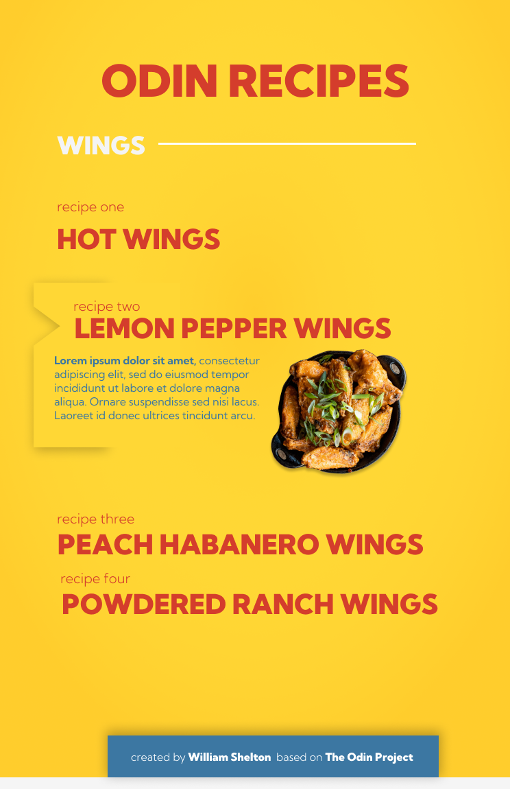

# odin-recipes :hamburger:

---

This project is based on the one assigned in the Odin Project's Foundations Course covering basic HTML. It is used to demonstrate an understanding of the following skills: 

 - HTML syntac including elements such as the h1, p, and anchor tags.
 - Proper file pathing for assets such as images and links.
 
 ### Built with

- HTML
- CSS
- Figma 
 
 ## My process

 My intial process begin with a mock up design for the site created in Figma. I wanted something simple and took inspiration from local print chicken resturant ads. 

 

I wanted to design the layout of the site with a "mobile first" mentality and tried to begin the coding process by creating the mobile version of the site first. 

---

### What I learned
During the course of the project I learned several techniques around using flexbox to create containers that can expand and collaspe when activated. I also played around with CSS animations, mostly transitions, and how to manipulate selectors in css. 

### Going Foward
The challenges I faced during this project mainly involved the Footer section. I had difficulty keeping it at the bottom of the viewport at various screen sizes, and I ultimately came to the conclusion that I need more experience with CSS layout and responsive design. 
